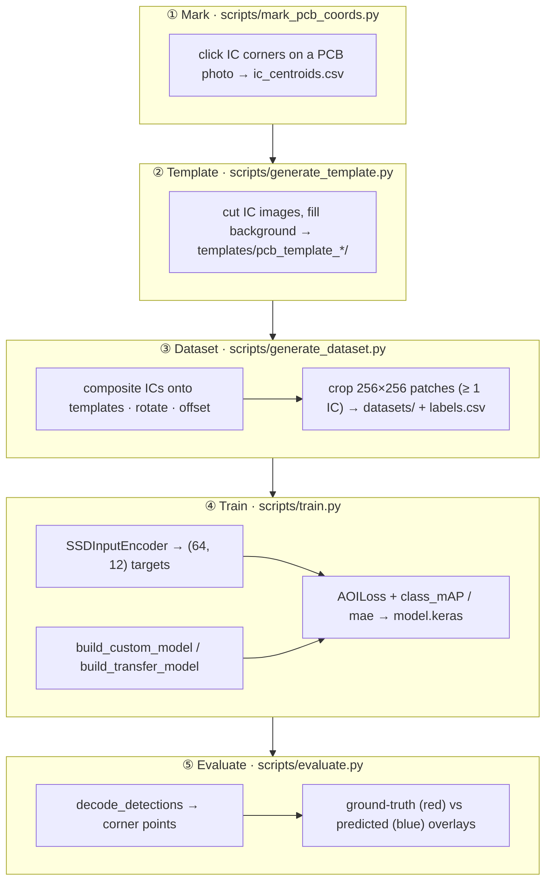
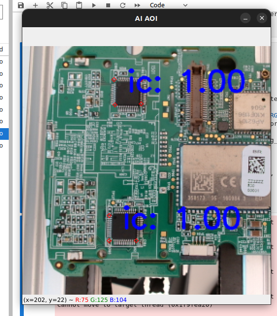
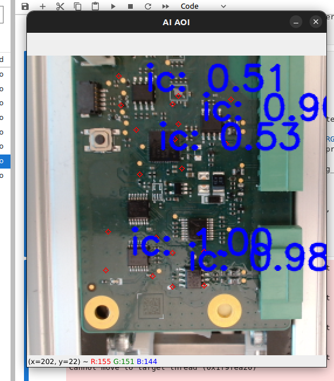
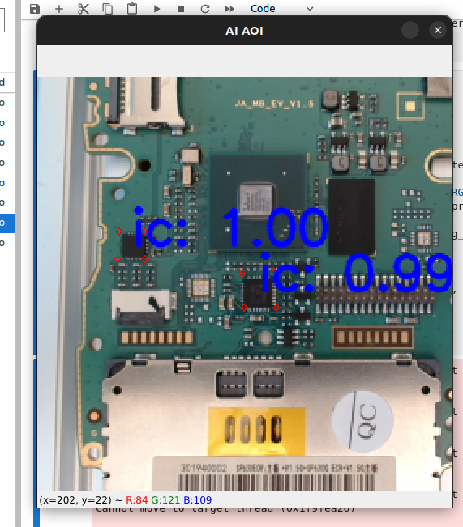

# AOI-PCB-SSD: Automated Optical Inspection for PCBA Assembly Lines

[](https://www.python.org/downloads/)
[](LICENSE)
[](https://github.com/keremaras1/aoi-pcb-v2-object-detector/actions/workflows/ci.yml)

A deep learning system for detecting integrated-circuit (IC) placement defects on printed circuit board assemblies (PCBAs), implementing the custom Single Shot MultiBox Detector (SSD) described in:

> *Automated Optical Inspection for Quality Control in PCBA Assembly Lines: A Case Study for Point of Sale Devices Production Lines* — Aras, Saif, Giuseppi & Coskun, **2024 IEEE HORA** — [doi:10.1109/HORA61326.2024.10550768](https://doi.org/10.1109/HORA61326.2024.10550768)

## Overview

Automated Optical Inspection (AOI) is a standard quality-control step in PCB assembly, but most deployed systems rely on comparing each board against a reference "golden sample" and are brittle to lighting, rotation, and minor design changes. This project, developed as a case study for Electronic Funds Transfer Point-of-Sale (EFT-POS) device production, replaces that approach with a deep neural network that **classifies IC components and localises their four corner points directly** — no golden sample required, and compact enough for limited-hardware assembly-line settings.

Two practical constraints drive the design:

- **No hand-labelled data** — Training images are synthesised by compositing real IC cutouts onto PCB template backgrounds with randomised rotation and Gaussian-distributed placement offsets. A representative dataset is generated programmatically.
- **Corner-point detection, not bounding boxes** — Each IC is matched to the grid cell whose centre is nearest (rather than by IoU), and the network regresses four corner offsets per cell. This captures component rotation, which axis-aligned boxes cannot.

The detection head emits a fixed `(64, 12)` tensor per image: for each of the 8×8 grid cells, two class scores, eight corner-offset coordinates, and the cell's anchor centre.

## Pipeline



## Architecture

The system provides two architectures that share an identical three-branch detection head and `(64, 12)` output.

### Custom architecture (Figure 3)

A six-block convolutional feature extractor producing 8×8 feature maps:

| Block | Layers                     | Filters | Kernel  |
|-------|----------------------------|---------|---------|
| 1     | Conv · BN · ReLU · MaxPool | 32      | **5×5** |
| 2     | Conv · BN · ReLU · MaxPool | 64      | **5×5** |
| 3     | Conv · BN · ReLU · MaxPool | 128     | 3×3     |
| 4     | Conv · BN · ReLU           | 256     | 3×3     |
| 5     | Conv · BN · ReLU · MaxPool | 512     | 3×3     |
| 6     | Conv · BN · ReLU           | 512     | 3×3     |

The wider 5×5 kernels in the first two blocks give a larger receptive field for the segmentation-like corner-localisation task (paper §IV.B). Three branches read directly from the final feature map:

- **Classification** — softmax IC-vs-background scores per cell.
- **Corner localisation** — four (x, y) corner offsets per cell, relative to the cell centre.
- **Grid centres** — the `GridCenters` layer supplies each cell's anchor coordinate.

### Transfer-learning architecture (Figure 4)

Replaces the custom feature extractor with a **MobileNetV2** backbone (ImageNet weights, frozen or fine-tuned) plus a single adapter block, followed by the same detection head. Chosen for its low parameter count and edge-deployment suitability.

The custom loss (paper §V) combines hard-negative-mined softmax cross-entropy for classification with a piecewise L1/L2 corner-localisation term, weighted by α.

## Demo

Live camera inference from the paper's §VII real-time demo. Detected IC corners are drawn in blue with per-detection confidence scores; the model runs on a laptop GPU in real time.

| Two ICs, 1.00 confidence | Dense board, five detections | Cross-board generalisation |
|:---:|:---:|:---:|
|  |  |  |

## Installation

Requires Python ≥ 3.12 and TensorFlow 2.18.

### With uv (recommended)

```bash
git clone https://github.com/keremaras1/aoi-pcb-v2-object-detector.git
cd aoi-pcb-v2-object-detector

# CPU only
uv sync --extra dev

# Apple Silicon GPU (tensorflow-metal)
uv sync --extra dev --extra metal

# Linux / WSL2 CUDA GPU
uv sync --extra dev --extra cuda

# With notebook dependencies (matplotlib, jupyterlab)
uv sync --extra dev --extra notebooks
```

Then prefix any command with `uv run` (e.g. `uv run python scripts/train.py ...`) or activate the managed venv with `source .venv/bin/activate`.

### With pip (fallback)

```bash
git clone https://github.com/keremaras1/aoi-pcb-v2-object-detector.git
cd aoi-pcb-v2-object-detector
pip install -e ".[dev]"         # CPU
pip install -e ".[dev,metal]"   # Apple Silicon GPU
pip install -e ".[dev,cuda]"    # Linux / WSL2 CUDA GPU
```

## Usage

### 1. (Optional) Add a new PCB template

```bash
# Mark IC corner locations on a new PCB photo
python scripts/mark_pcb_coords.py

# Cut IC images and build the template directory
python scripts/generate_template.py
```

Twenty-seven ready-made templates are already checked into `templates/`, so you can skip straight to dataset generation.

### 2. Generate the dataset

```bash
python scripts/generate_dataset.py
# or with a custom config:
python scripts/generate_dataset.py --config path/to/config.json
```

Composites ICs onto the templates and crops 256×256 patches (each guaranteed to contain at least one IC) into `datasets/`, with a `labels.csv` of eight-point corner annotations.

### 3. Train

```bash
# Custom architecture (Figure 3)
python scripts/train.py --architecture custom

# MobileNetV2 transfer learning (Figure 4)
python scripts/train.py --architecture transfer

# Custom config and output directory
python scripts/train.py --architecture custom --config path/to/config.json \
    --output-dir experiments/my_run
```

Each run saves `model.keras`, a per-epoch training-log CSV, and a `config.json` snapshot to a timestamped directory under `experiments/`.

### 4. Evaluate

```bash
# Auto-detect the most recently modified run
python scripts/evaluate.py

# Evaluate a specific run, saving prediction overlays
python scripts/evaluate.py \
    --model-path experiments/run_YYYYMMDD_HHMMSS/model.keras \
    --save-visuals --n-visuals 20
```

You can also sanity-check generated labels before training:

```bash
python scripts/visualize_labels.py --data-dir datasets/train --output-dir visualizations/
```

### Notebooks

Interactive walkthroughs live in `notebooks/`:

- `training.ipynb` — data loading → architecture (custom or transfer via a switch) → training loop → loss / mAP curves.
- `inference.ipynb` — load a run → evaluate on the validation split → decode predictions → corner-point overlays.
- `camera_inference.ipynb` — the paper's §VII live demo: webcam loop with real-time corner detection (local machine with a camera; press **ESC** to quit).

## Configuration

All parameters live in `config.json`:

| Section        | Key parameters                                                                                          |
|----------------|---------------------------------------------------------------------------------------------------------|
| `generator`    | `templates_dir`; per-split `dataset_size`, `rotation_range`, `placement_offset_x/y`, `img_size`, `seed`, output dirs |
| `model`        | `img_height/width/channels`, `n_classes`, `normalize_coords`, `subtract_mean`, `divide_by_stddev`, `l2_regularization`, `predictor_sizes` |
| `training`     | `batch_size`, `epochs`, `val_split`, `random_seed`, `optimizer.*`, `loss.{neg_pos_ratio, alpha}`, `early_stopping.*`, `lr_schedule.*` |
| `augmentation` | `enabled`, `probability`                                                                                |

## Testing

```bash
uv run pytest       # via uv
# or: pytest        # with venv activated
```

The suite covers the config loader, data utilities, the synthetic generation pipeline, the SSD encoder/decoder and nearest-centre matching, the `GridCenters` layer, both model architectures, the custom loss, and all metrics — with **100% statement coverage** across `src/aoi_pcb_ssd/`. Tests are fully hermetic: synthetic templates and tensors are built in `tmp_path`, models are constructed with `weights=None`, and no real PCB images, pre-trained weights, or pre-generated datasets are required.

## Project Structure

```
aoi-pcb-v2-object-detector/
├── config.json
├── pyproject.toml
├── LICENSE
├── NOTICE
├── templates/                       # 27 PCB templates (IC cutouts + corner CSVs)
├── datasets/                        # generated data (gitignored — run generate_dataset.py)
├── experiments/                     # training runs (gitignored — run train.py)
├── src/aoi_pcb_ssd/
│   ├── config_loader.py
│   ├── data/                        # template, dataset_generator, augmentation, data_generator, utils
│   ├── encoding/                    # input_encoder, output_decoder, matching
│   └── model/                       # grid_centers, ssd_custom, ssd_transfer, loss, metrics
├── scripts/                         # mark_pcb_coords, generate_template, generate_dataset,
│                                    # visualize_labels, train, evaluate
├── notebooks/                       # training, inference, camera_inference
└── tests/
```

## Citation

```bibtex
@INPROCEEDINGS{aras2024aoi,
  author={Aras, Kerem and Saif, Syed Saad and Giuseppi, Alessandro and Coskun, Vedat},
  booktitle={2024 International Congress on Human-Computer Interaction, Optimization
             and Robotic Applications (HORA)},
  title={Automated Optical Inspection for Quality Control in PCBA Assembly Lines:
         A Case Study for Point of Sale Devices Production Lines},
  year={2024},
  doi={10.1109/HORA61326.2024.10550768}
}
```

## Acknowledgements

The SSD encoder/decoder, loss, and anchor layer are derived from
[`pierluigiferrari/ssd_keras`](https://github.com/pierluigiferrari/ssd_keras)
(Copyright 2018 Pierluigi Ferrari), released under the Apache License, Version 2.0.
The custom feature extractor, three-branch corner-point detection head, nearest-centre
matching, and grid-centre anchoring are original contributions of this work. See
[`NOTICE`](NOTICE) for per-file attribution.

## License

Licensed under the Apache License, Version 2.0 — see [`LICENSE`](LICENSE).
